# FreeOpennSourceSoftware
School study records.

## resources
課本: git-learn-git

Git 練習場: https://gitbook.tw/playground

### 09262023
Git 之 SHA-1 與四大物件: Blob, Tree, Commit, Tag: 講義 (git-learn-git.pdf) 頁數: 99-129

#### 作業_1:
HW02A git (II): git 分支: 
    練習 6.1 ~ 6.4 指令

HEAD: 目前所在分支。
SHA-1 編碼: 生成不同的 commit 身份證號，區分commit。

指令:
git commit
    新增一個commit（圓圈）。將暫存區裡的檔案，儲存到Repository。灰色圆圈為已完成commit內容的記錄;緣色圆圈為最新的commit記錄。
    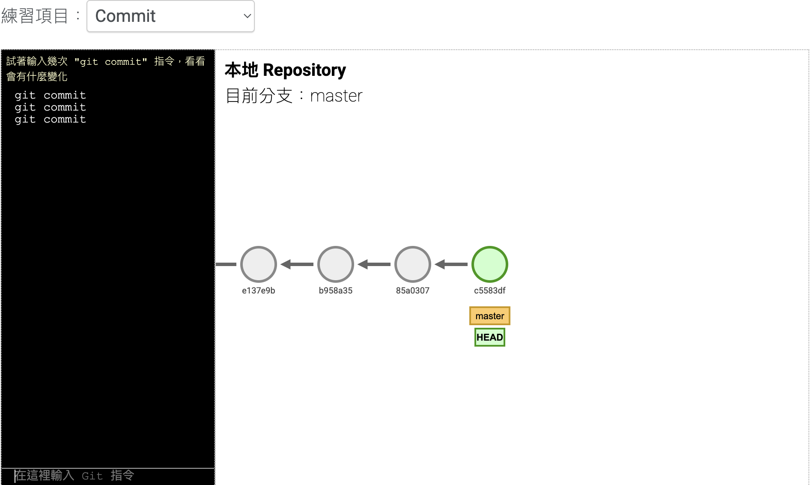

git branch branch_name
    新增一個分支（方塊）。

git checkout branch_name
    將 HEAD 跳轉至指定分支。
    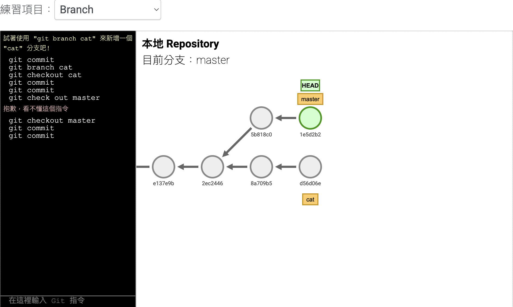

git merge branch_name
    將 指定分支 合併至 HEAD 分支。
    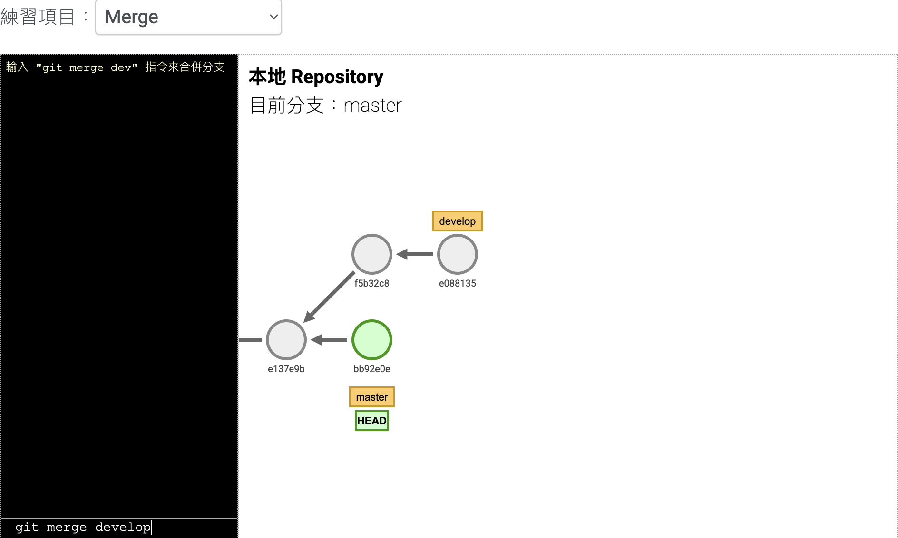
    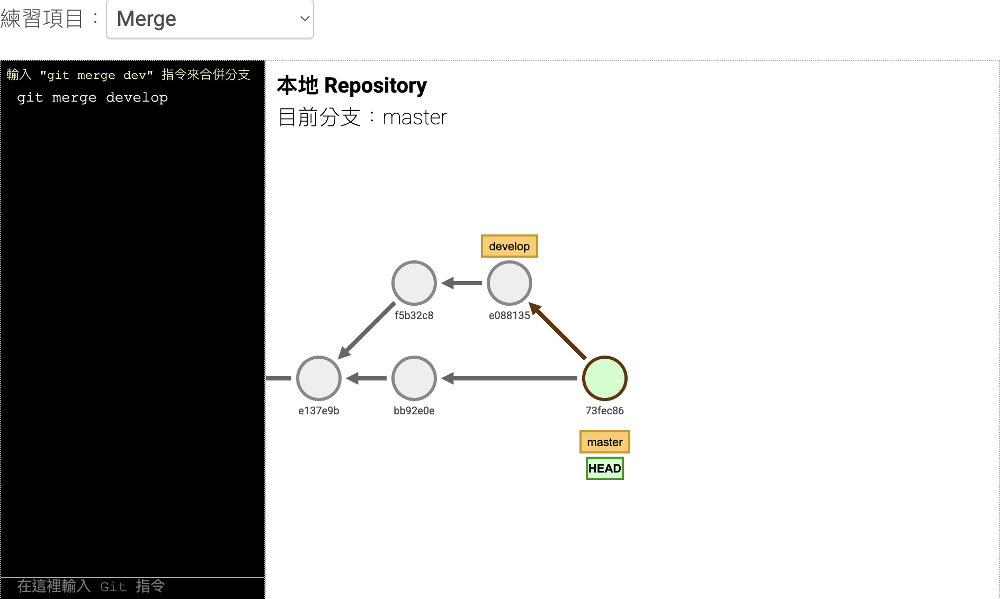

git tag tag_name
    將 HEAD 所在 commit 加上 tag。
    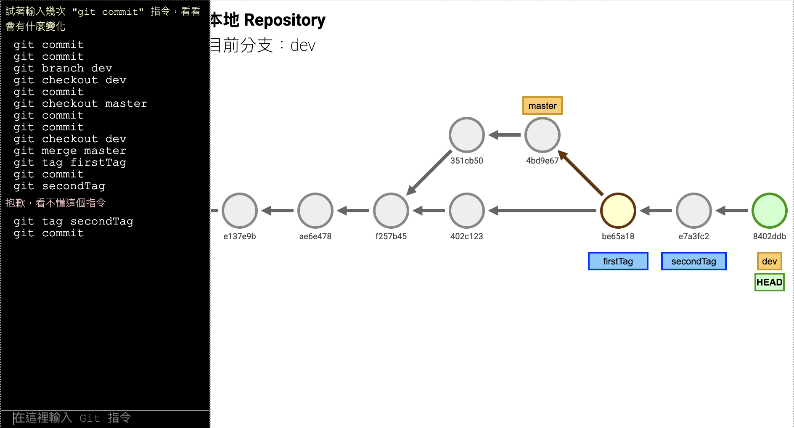

git reset HEAD^
    跳轉回 HEAD 上級之 commit，一個 '^' 跳一級。
    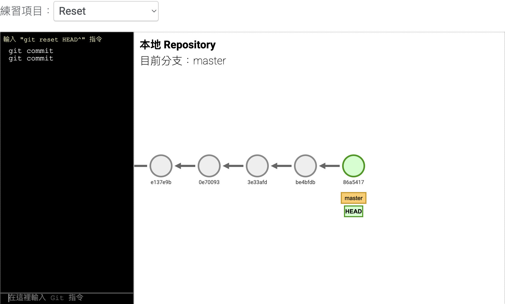
    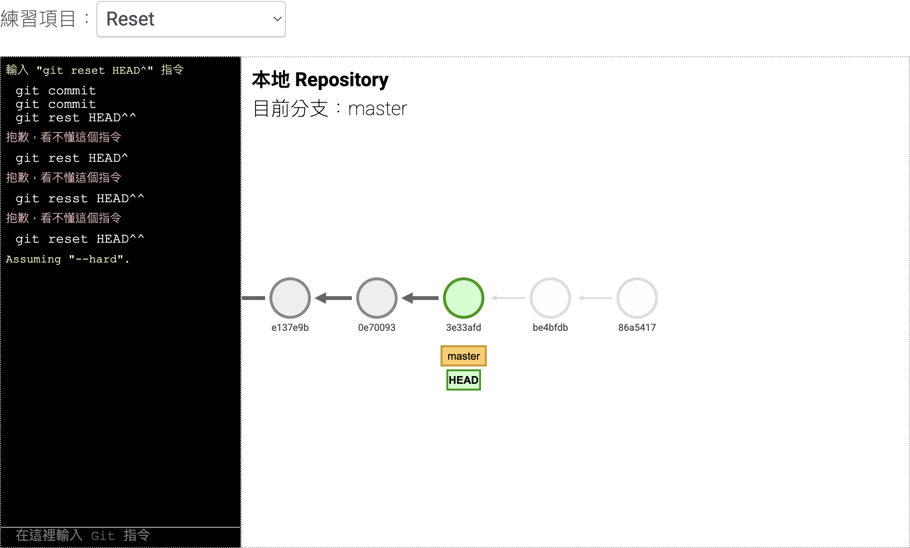

git rebase branch_name
    將 HEAD 所在分支，串接至指定分支後方。
    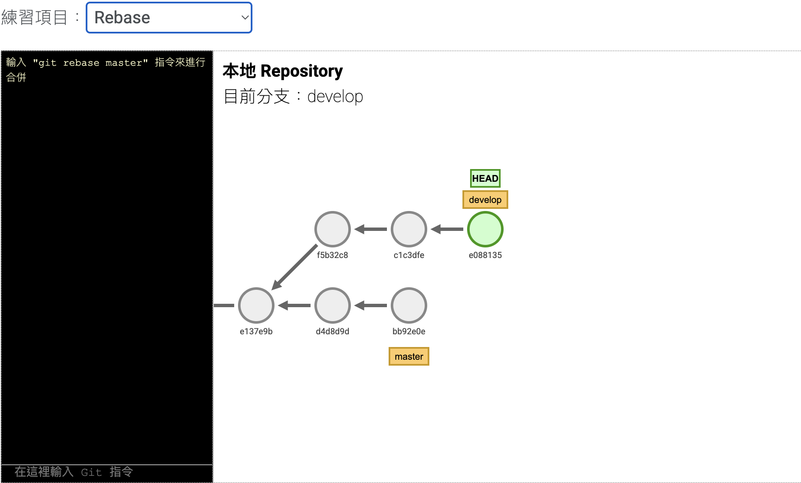
    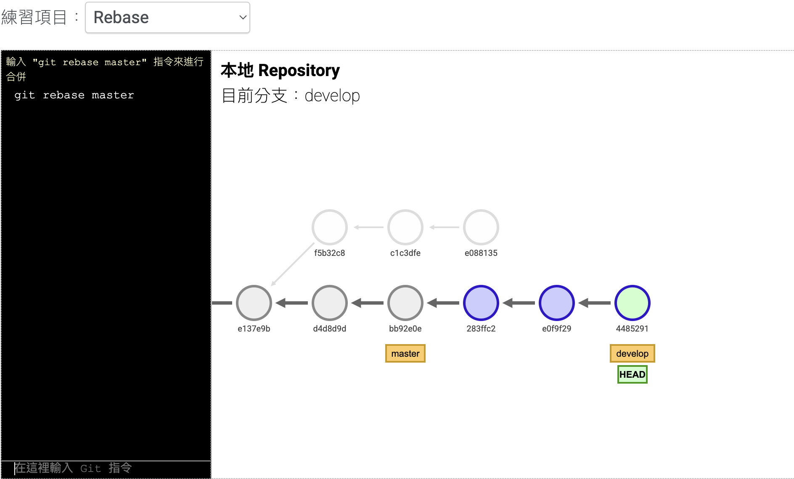

git revert commit_name
    將指定 commit(黃) 刪除，並生成該操作的新紀錄 commit（綠）。
    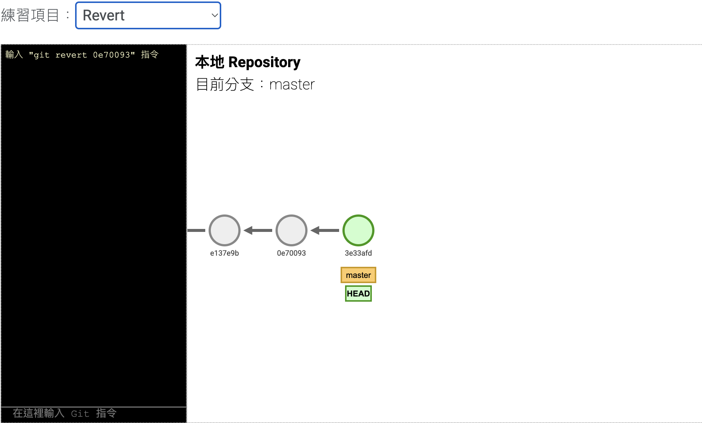
    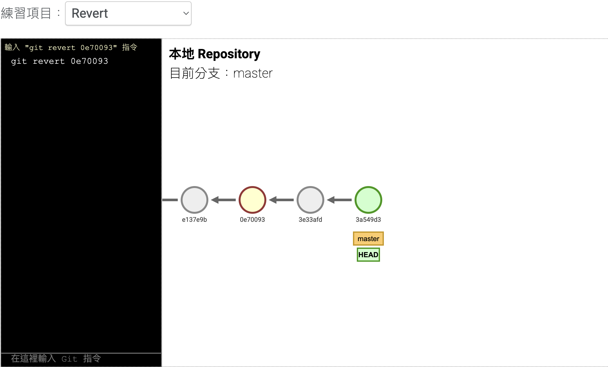

解答: https://moodle.thu.edu.tw/pluginfile.php/1604525/mod_label/intro/open-git2-example.png

#### 作業_2:
HW02B git (II): git 分支練習場
    以branch, checkout, commit, reset指令，在練習場產生以下樹狀圖
    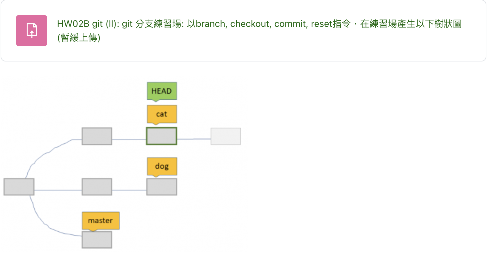
    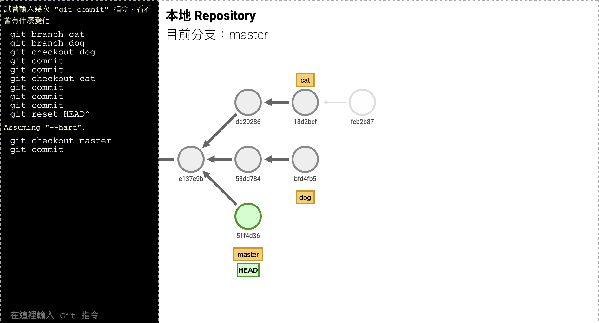

